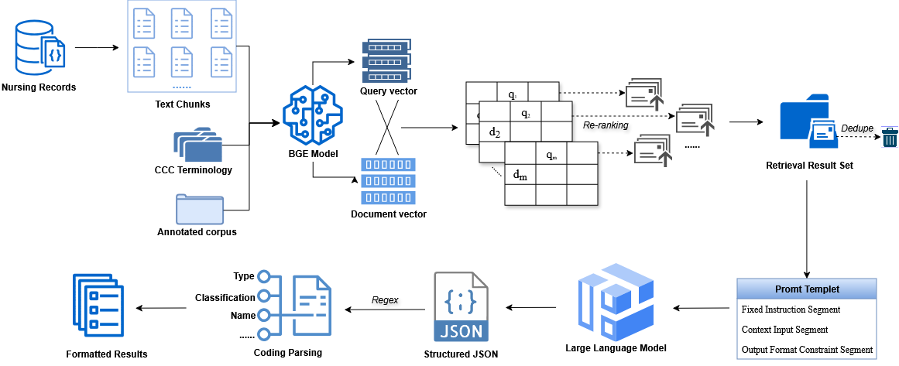

# CNTRAM

**Automated Identification of Nursing Diagnoses and Interventions from Nursing Records: A Retrieval-Augmented Large Language Model Approach**

## Overview

CNTRAM is a two-stage Retrieval-Augmented Generation (RAG) framework that leverages Large Language Models (LLMs) for automated mapping of free-text nursing records to standardized Clinical Care Classification (CCC) terminology.

## Architecture



## Installation

```bash
cd CNTRAM

# Install dependencies
uv sync
```

## Configuration

1. Copy the example environment file:
```bash
cp .env.example .env
```

2. Set your API key in `.env`:
```
DEEPSEEK_API_KEY=your-api-key-here
OLLAMA_BASE_URL=http://localhost:11434
```

## Usage

### API Server

```bash
uv run app.py
```

### Streamlit Web Interface

```bash
streamlit run streamlit_app.py
```


## Citation

If you use this code in your research, please cite:

```bibtex
@article{cntram2026,
  title={Automated Identification of Nursing Diagnoses and Interventions from Nursing Records: A Retrieval-Augmented Large Language Model Approach},
  author={},
  journal={},
  year={2026}
}
```
